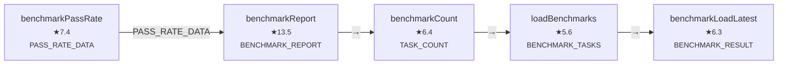
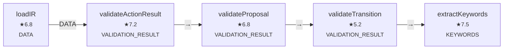
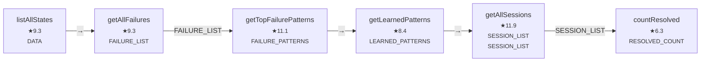
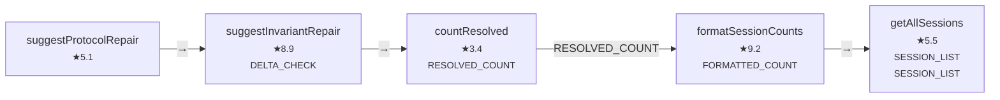
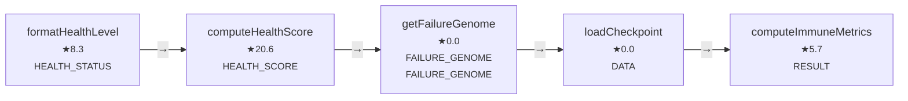

# Capability Graph Report

## Overview
- Total functions: **549**
- Exported: **226**
- With produces: **317** (58%)
- With requires: **230** (42%)
- With purpose: **549** (100%)
- Data-flow edges: **3392**

## Top Domains
| Tag | Functions |
|-----|----------|
| (external) | 94 |
| semantic | 69 |
| memory | 56 |
| layer | 56 |
| validator | 40 |
| planner | 34 |
| trace | 33 |
| ssg | 32 |
| ledger | 29 |
| topology | 25 |

## Coverage Trend
- v2.1.4: requires ~26%, produces ~26%, purpose ~30%
- v2.5.x: requires **46%**, produces **62%**, purpose **100%**
- Target (v2.6): requires **80%+**, produces **80%+**

## Sample Chains

## Chain: "generate benchmark report" (score: 6.1)

## Chain: "extract IR from project and validate the actions" (score: 5.4)

## Chain: "list all sessions and find failure patterns" (score: 8.2)

## Chain: "suggest repairs for a failed session" (score: 5.7)

## Chain: "compute system health score" (score: 5.6)

## Full Capability Graph

```mermaid
graph LR
  main[/"main"/]
  executeActionCode[/"executeActionCode"/]
  auditDirectory[/"auditDirectory"/]
  formatAuditResult[/"formatAuditResult"/]
  benchmarkCount[/"benchmarkCount"/]
  main[/"main"/]
  benchmarkPassRate[/"benchmarkPassRate"/]
  benchmarkReport[/"benchmarkReport"/]
  benchmarkSave[/"benchmarkSave"/]
  benchmarkLoadLatest[/"benchmarkLoadLatest"/]
  main[/"main"/]
  generateBranchId[/"generateBranchId"/]
  createRootBranch[/"createRootBranch"/]
  createBranch[/"createBranch"/]
  forkBranch[/"forkBranch"/]
  mergeBranches[/"mergeBranches"/]
  flattenBranch[/"flattenBranch"/]
  getBranchPath[/"getBranchPath"/]
  replayBranch[/"replayBranch"/]
  buildBranchMap[/"buildBranchMap"/]
  findRootBranch[/"findRootBranch"/]
  findChildBranches[/"findChildBranches"/]
  describeBranchTree[/"describeBranchTree"/]
  evaluateBranches[/"evaluateBranches"/]
  wrapAsBranch[/"wrapAsBranch"/]
  unwrapBranchTree[/"unwrapBranchTree"/]
  deriveMetadata["deriveMetadata"]
  applyDerivedMetadata[/"applyDerivedMetadata"/]
  replaySession[/"replaySession"/]
  replayLedger[/"replayLedger"/]
  replayWithDetail[/"replayWithDetail"/]
  emitCode[/"emitCode"/]
  recordGeneration[/"recordGeneration"/]
  getExecutionMetrics[/"getExecutionMetrics"/]
  execute[/"execute"/]
  verifyCompiles[/"verifyCompiles"/]
  verifyFileMarker[/"verifyFileMarker"/]
  extractIRPython[("extractIRPython")]
  extractIR[/"extractIR"/]
  extractIRWithTypes[/"extractIRWithTypes"/]
  classifyError[/"classifyError"/]
  classifyPlanError[/"classifyPlanError"/]
  recordFailure[/"recordFailure"/]
  loadFailures[/"loadFailures"/]
  failureStats[/"failureStats"/]
  formatFailureStats[/"formatFailureStats"/]
  saveCheckpoint[/"saveCheckpoint"/]
  loadCheckpoint[("loadCheckpoint")]
  clearCheckpoint[/"clearCheckpoint"/]
  recordFailure["recordFailure"]
  recordSession[/"recordSession"/]
  getAllFailures[/"getAllFailures"/]
  getFailuresBySVL[/"getFailuresBySVL"/]
  getTopFailurePatterns[/"getTopFailurePatterns"/]
  getFailureGenome[/"getFailureGenome"/]
  getAllSessions[/"getAllSessions"/]
  getLearnedPatterns[/"getLearnedPatterns"/]
  queryAntibodies[/"queryAntibodies"/]
  getSemanticHeatmap[/"getSemanticHeatmap"/]
  getAntibodyStats[/"getAntibodyStats"/]
  generateCandidateRules[/"generateCandidateRules"/]
  main[/"main"/]
  loadFeedback[/"loadFeedback"/]
  saveFeedback[/"saveFeedback"/]
  getFunctionSuccessRate[/"getFunctionSuccessRate"/]
  getWeightedSuccessRate[/"getWeightedSuccessRate"/]
  getFailureAdjustedCredit[/"getFailureAdjustedCredit"/]
  recordRun[/"recordRun"/]
  withLock["withLock"]
  main["main"]
  main[/"main"/]
  generateMermaid[("generateMermaid")]
  generateDOT[("generateDOT")]
  generateChainViz[("generateChainViz")]
  generateGraphReport[("generateGraphReport")]
  computeHealthScore[/"computeHealthScore"/]
  formatHealthLevel[/"formatHealthLevel"/]
  countSessionLedgers[/"countSessionLedgers"/]
  main[/"main"/]
  computeImmuneMetrics[/"computeImmuneMetrics"/]
  auditDirectory -->|"AUDIT_RESULT"| formatAuditResult
  main -->|"BENCHMARK_TASKS"| benchmarkCount
  main -->|"BENCHMARK_TASKS"| benchmarkPassRate
  benchmarkPassRate -->|"PASS_RATE_DATA"| benchmarkReport
  benchmarkLoadLatest -->|"BENCHMARK_RESULT"| benchmarkSave
  main -->|"BENCHMARK_TASKS"| benchmarkCount
  main -->|"BENCHMARK_TASKS"| benchmarkPassRate
  flattenBranch -->|"TRANSITIONS"| createRootBranch
  flattenBranch -->|"TRANSITIONS"| wrapAsBranch
  flattenBranch -->|"TRANSITIONS"| replayWithDetail
  unwrapBranchTree -->|"TRANSITIONS"| createRootBranch
  unwrapBranchTree -->|"TRANSITIONS"| wrapAsBranch
  unwrapBranchTree -->|"TRANSITIONS"| replayWithDetail
  recordGeneration -->|"METRICS_DATA"| getExecutionMetrics
  loadFailures -->|"FAILURE_LIST"| failureStats
  loadFailures -->|"FAILURE_LIST"| getFailuresBySVL
  loadFailures -->|"FAILURE_LIST"| getTopFailurePatterns
  loadFailures -->|"FAILURE_LIST"| failureStats
  loadFailures -->|"FAILURE_LIST"| getFailuresBySVL
  loadFailures -->|"FAILURE_LIST"| getTopFailurePatterns
  loadFailures -->|"FAILURE_LIST"| failureStats
  loadFailures -->|"FAILURE_LIST"| getFailuresBySVL
  loadFailures -->|"FAILURE_LIST"| getTopFailurePatterns
  failureStats -->|"FAILURE_STATS"| formatFailureStats
  failureStats -->|"FAILURE_STATS"| formatFailureStats
  failureStats -->|"FAILURE_STATS"| formatFailureStats
  loadCheckpoint -->|"DATA"| saveCheckpoint
  loadCheckpoint -->|"DATA"| clearCheckpoint
  getAllFailures -->|"FAILURE_LIST"| failureStats
  getAllFailures -->|"FAILURE_LIST"| getFailuresBySVL
  getAllFailures -->|"FAILURE_LIST"| getTopFailurePatterns
  getFailureGenome -->|"FAILURE_GENOME"| computeHealthScore
  getFailureGenome -->|"FAILURE_GENOME"| computeHealthScore
  getAllSessions -->|"SESSION_LIST"| countSessionLedgers
  getAllSessions -->|"SESSION_LIST"| countSessionLedgers
  getAllSessions -->|"SESSION_LIST"| countSessionLedgers
  getAllSessions -->|"SESSION_LIST"| countSessionLedgers
  main -->|"FAILURE_LIST"| failureStats
  main -->|"FAILURE_LIST"| getFailuresBySVL
  main -->|"FAILURE_LIST"| getTopFailurePatterns
  main -->|"FAILURE_GENOME"| computeHealthScore
  computeHealthScore -->|"HEALTH_SCORE"| formatHealthLevel
```

