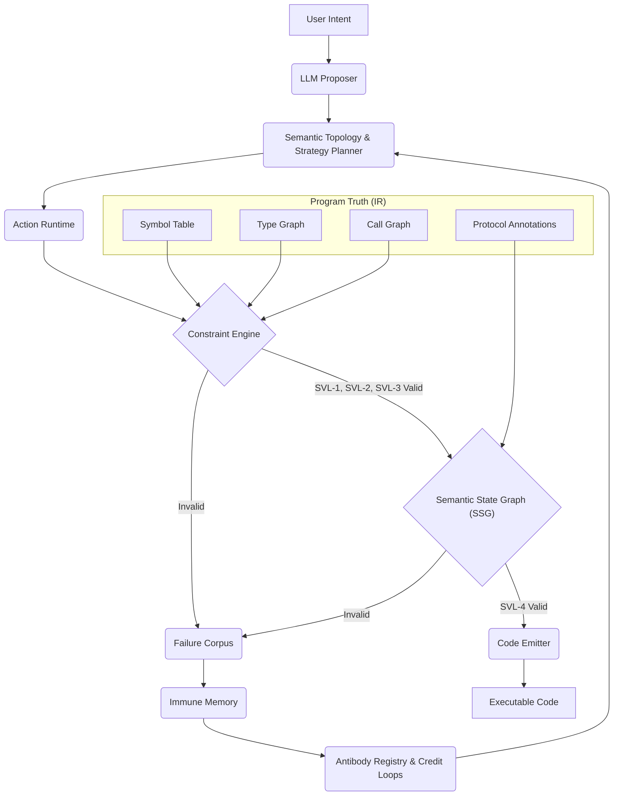

# Progmune Runtime（免序）


**程序免疫学：为 AI 生成代码构建可信赖的免疫系统**

[](https://opensource.org/licenses/MIT)
[](https://modelcontextprotocol.io)
[]()

---

## 💡 核心价值：为什么你的 AI 代码需要“免疫”与“生成”？

在 AI 辅助编程的时代，大语言模型（LLM）带来了前所未有的效率，但也伴随着“认知缺陷”：

*   **幻觉**：LLM 可能会凭空捏造不存在的函数、类或变量，导致运行时错误。
*   **类型漂移**：参数数量或类型与实际函数签名不匹配，引发类型错误。
*   **协议违规**：生成违反业务逻辑顺序的代码，例如在用户未认证前就签发令牌。

**Progmune Runtime 旨在解决这些核心痛点，为 AI 生成代码提供一个强大的“免疫系统”，同时赋能可信赖的“生成”能力。**

它将 LLM 从一个“不受约束的代码生成器”降级为**“受约束的启发式提议者”**，将代码的最终决定权交还给**程序真相（Intermediate Representation, IR）**。这意味着，Progmune 不仅能**消除代码幻觉**，**保障协议安全**，还能通过学习历史错误**“越用越聪明”**，显著提升 AI 生成代码的可靠性和安全性。

**核心理念：以免疫保障生成，以生成驱动免疫。**

*   **免疫**：通过多层验证机制，确保 AI 生成的每一步都符合程序真相和业务逻辑。
*   **生成**：在免疫系统的约束下，高效、智能地将模糊意图转化为可执行的、高质量的代码。

**对开发者的直接价值：**
*   **🚫 终结代码幻觉**：生成的代码 100% 保证只调用项目中真实存在的函数和变量。
*   **🛡️ 协议级安全**：自动拦截非法的业务逻辑跳转，确保代码行为符合预期。
*   **🧠 越用越聪明**：系统从失败中学习，自动形成“抗体”，修复类似问题，减少 LLM token 消耗。
*   **🚀 提升开发效率**：减少调试和重构 AI 生成代码的时间，让开发者更专注于业务逻辑。

---

## 🏗️ 核心架构：生成与免疫的协同

Progmune Runtime 的设计灵感来源于生物免疫系统，构建了多层防御机制，确保 AI 生成代码的语义有效性。其核心架构清晰地展示了“生成”与“免疫”两大核心能力的协同工作：


1.  **用户意图 (User Intent)**：开发者以自然语言描述其编程需求。

2.  **LLM 提议者 (LLM Proposer)**：大语言模型根据用户意图，生成初步的、高层次的动作序列提议。它不再直接生成代码，而是提出一系列抽象的函数调用和逻辑结构。

3.  **语义拓扑与策略规划器 (Semantic Topology & Strategy Planner)**：
    *   **语义拓扑 (Semantic Topology)**：从程序真相 (IR) 中构建一个语义相似度图，理解项目中函数、模块之间的关联性。
    *   **策略规划器 (Strategy Planner)**：利用语义拓扑，将 LLM 的模糊意图映射到项目内具体、可执行的**能力链 (Capability Chains)**。这是从意图到可执行动作的关键“生成”步骤。

4.  **Action Runtime —— 确定性合成边界**：
    *   **作用**：LLM 的提议和策略规划器生成的链，在这里被转化为一组**确定性 API 调用**（如 `call(func, ...args)`、`ifElse(condition, thenFn, elseFn)`）。这些 API 在沙箱环境中执行，并捕获为结构化的**动作树 (Action Tree)**。
    *   **价值**：从源头消除了代码注入漏洞和格式错误，将 LLM 的输出限制在可控、可验证的结构内。

5.  **程序真相 (IR) —— 自我模型**：
    *   **作用**：Progmune 的“基因组”，是系统对项目代码的唯一、确定性认知。它通过静态分析源代码，提取出**符号表、类型图、调用图**和可选的**协议注解**。
    *   **价值**：定义了 AI 可以操作的“封闭世界”，是所有后续验证的基础，确保 AI 不会“幻想”出不存在的实体。

6.  **约束引擎 (Constraint Engine) —— 天然免疫层**：
    *   **作用**：基于 IR 对动作树进行快速、规则化的验证，主要检查 **SVL-1（符号存在性）、SVL-2（类型有效性）和 SVL-3（数据流正确性）**。
    *   **价值**：在毫秒级拦截最常见的“低级错误”（如函数不存在、参数类型不匹配），提供第一道防线。

7.  **语义状态图 (Semantic State Graph, SSG) —— 获得性免疫层**：
    *   **作用**：通过可编程的状态机，建模系统资源的有效状态及其允许的转移。它验证 **SVL-4（协议合法性）**，确保函数调用序列符合预定义的业务协议（例如，`UNAUTHENTICATED` -> `AUTHENTICATED` -> `TOKEN_ISSUED`）。
    *   **价值**：防止 AI 生成违反业务流程的代码，将验证从静态正确性提升到行为合法性。v2.1.4 引入的 **BFS 协议修复**功能，使其能自动补全复杂的协议缺失。

8.  **免疫记忆与失败语料库 (Immune Memory & Failure Corpus) —— 免疫记忆层**：
    *   **作用**：每次约束违规都会被记录到**失败语料库**中，包含意图、错误详情和 SSG 状态。系统从这些失败模式中学习，生成高置信度的“抗体规则”，并存储在**抗体注册表 (Antibody Registry)** 中。
    *   **价值**：使系统能够从错误中学习，形成“免疫记忆”，主动预防未来同类错误。**信用循环 (Credit Loops)** 机制根据函数历史成功率动态调整权重，优化模糊意图下的能力链选择。

9.  **代码发射器 (Code Emitter) —— 程序落地层**：
    *   **作用**：将所有验证通过的动作树确定性地翻译为可执行的 Python 或 TypeScript 代码，处理导入、变量作用域和代码格式化。
    *   **价值**：确保最终生成的代码是安全、正确且可用的。

---

## 📊 语义有效性级别 (SVL)

我们定义了 AI 生成代码的“健康标准”，为系统提供分层、可量化的验证保证：

| 级别 | 名称 | 描述 | Progmune 的保证 |
|:-----|:-----|:-----|:-----|
| **SVL-1** | 符号存在性 | 每个被调用的函数、变量和导入在项目中均实际存在 | 100% 消除幻觉 API 调用 |
| **SVL-2** | 类型有效性 | 参数数量和类型与声明的签名相匹配 | 100% 消除类型不匹配错误 |
| **SVL-3** | 数据流正确性 | 变量在使用前已声明；无循环引用或未初始化访问 | 100% 消除 NameError / UnboundLocalError |
| **SVL-4** | 协议合法性 | 函数调用序列符合声明的前/后状态转换规则 | 严格遵守业务状态机，无非法状态跳转 |
| **SVL-5** | 语义意图正确性 | 生成代码忠实实现预期业务逻辑 | 远期目标；当前版本通过 SVL-1~4 间接保障 |

Progmune Runtime v2.1.4 完整保证 SVL-1 至 SVL-3，SVL-4 作为可选协议约束系统实现。SVL-5 为开放性研究方向。

---

## 🚀 快速上手指南

### 前置条件
*   [Node.js](https://nodejs.org/) >= 18
*   一个有效的 LLM API 密钥（支持 OpenAI 兼容接口，推荐使用具备强推理能力的模型）

### 1. 全局安装

```bash
npm install -g progmune-runtime
```

### 2. 初始化配置

在你的项目根目录下运行 setup，配置你的 API 密钥：

```bash
npx progmune-runtime setup "YOUR_API_KEY"
```
*(提示：你也可以通过设置环境变量 `OPENAI_API_KEY` 来配置)*

### 3. 提取程序真相 (IR)

让 Progmune 扫描你的项目，建立“自我认知”：

```bash
npx progmune-runtime ir .
```
这会在项目目录下生成一个 `.progmune/ir.json` 文件，它是后续所有验证的基础。

### 4. 启动 MCP 服务器 (可选)

如果你使用 Cursor、Claude Desktop 等支持 MCP (Model Context Protocol) 的客户端，可以直接启动 Progmune 作为 MCP 服务器，让你的 AI 助手获得免疫能力：

```bash
npx progmune-runtime start
```

### 5. 运行内置测试

验证系统是否正常工作：

```bash
npx progmune-runtime test
```

---

## 📖 深入阅读

想要了解更多关于“程序免疫学”的理论基础、SSG 状态机的配置方法以及 v2.1.4 的最新特性（如 BFS 协议修复、信用循环），请参阅我们的：

👉 **[《Program Immunology 技术白皮书》](./WHITEPAPER.md)**

---

## 🤝 参与贡献

Progmune 正在重新定义 AI 辅助编程——**让程序真相主导生成**。我们欢迎提交 Issue、Pull Request，或者在 Discussions 中分享你的想法！

## 📄 许可证

本项目采用 MIT License。

---

# Progmune Runtime (English Version)


**Program Immunology: Building a Trustworthy Immune System for AI-Generated Code**

[](https://opensource.org/licenses/MIT)
[](https://modelcontextprotocol.io)
[]()

---

## 💡 Core Value: Why Your AI Code Needs "Immunity" and "Generation"?

In the era of AI-assisted programming, Large Language Models (LLMs) bring unprecedented efficiency but also come with "cognitive deficiencies":

*   **Hallucinations**: LLMs may invent non-existent functions, classes, or variables, leading to runtime errors.
*   **Type Drift**: Mismatched parameter counts or types with actual function signatures, causing type errors.
*   **Protocol Violations**: Generating code that violates the logical order of business processes, such as issuing tokens before user authentication.

**Progmune Runtime aims to solve these core pain points by providing a robust "immune system" for AI-generated code, while also enabling trustworthy "generation" capabilities.**

It demotes LLMs from "unconstrained code generators" to **"constrained heuristic proposers,"** returning the ultimate decision-making power over code to **Program Truth (Intermediate Representation, IR)**. This means Progmune can not only **eliminate code hallucinations** and **ensure protocol security** but also **"get smarter with use"** by learning from historical errors, significantly enhancing the reliability and safety of AI-generated code.

**Core Philosophy: Immunity guarantees generation, and generation drives immunity.**

*   **Immunity**: Through multi-layered validation mechanisms, ensuring every step of AI generation conforms to program truth and business logic.
*   **Generation**: Under the constraints of the immune system, efficiently and intelligently transforms ambiguous intentions into executable, high-quality code.

**Direct Value for Developers:**
*   **🚫 End Code Hallucinations**: 100% guarantee that generated code only calls functions and variables that genuinely exist in your project.
*   **🛡️ Protocol-Level Security**: Automatically intercepts illegal business logic transitions, ensuring code behavior aligns with expectations.
*   **🧠 Smarter with Use**: The system learns from failures, automatically forming "antibodies" to fix similar issues, reducing LLM token consumption.
*   **🚀 Boost Development Efficiency**: Reduces time spent debugging and refactoring AI-generated code, allowing developers to focus more on business logic.

---

## 🏗️ Core Architecture: The Synergy of Generation and Immunity

Progmune Runtime's design is inspired by the biological immune system, building multi-layered defense mechanisms to ensure the semantic validity of AI-generated code. Its core architecture clearly illustrates the synergistic operation of its two core capabilities: "Generation" and "Immunity."



1.  **User Intent**: Developers describe their programming needs in natural language.

2.  **LLM Proposer**: The Large Language Model, based on user intent, generates preliminary, high-level proposals for action sequences. It no longer directly generates code but proposes a series of abstract function calls and logical structures.

3.  **Semantic Topology & Strategy Planner**:
    *   **Semantic Topology**: Constructs a semantic similarity graph from the Program Truth (IR), understanding the relationships between functions and modules within the project.
    *   **Strategy Planner**: Utilizes the Semantic Topology to map the LLM's ambiguous intentions to concrete, executable **Capability Chains** within the project. This is a crucial "generation" step from intent to executable actions.

4.  **Action Runtime — Deterministic Synthesis Boundary**:
    *   **Role**: The LLM's proposals and the capability chains generated by the Strategy Planner are translated here into a set of **deterministic API calls** (e.g., `call(func, ...args)`, `ifElse(condition, thenFn, elseFn)`). These APIs are executed in a sandboxed environment and captured as structured **Action Trees**.
    *   **Value**: Eliminates code injection vulnerabilities and formatting errors at the source, confining LLM output within a controllable and verifiable structure.

5.  **Program Truth (IR) — Self-Model**:
    *   **Role**: Progmune's "genome," the system's sole and deterministic understanding of project code. It statically analyzes source code to extract **Symbol Tables, Type Graphs, Call Graphs**, and optional **Protocol Annotations**.
    *   **Value**: Defines the "closed world" in which AI can operate, serving as the foundation for all subsequent validations, ensuring AI does not "hallucinate" non-existent entities.

6.  **Constraint Engine — Innate Immunity Layer**:
    *   **Role**: Performs rapid, rule-based validation of Action Trees based on the IR, primarily checking for **SVL-1 (Symbolic Existence), SVL-2 (Type Validity), and SVL-3 (Dataflow Correctness)**.
    *   **Value**: Intercepts the most common "low-level errors" (e.g., non-existent functions, parameter type mismatches) in milliseconds, providing the first line of defense.

7.  **Semantic State Graph (SSG) — Adaptive Immunity Layer**:
    *   **Role**: Models the valid states of system resources and their allowed transitions through programmable state machines. It validates **SVL-4 (Protocol Legality)**, ensuring that function call sequences conform to predefined business protocols (e.g., `UNAUTHENTICATED` -> `AUTHENTICATED` -> `TOKEN_ISSUED`).
    *   **Value**: Prevents AI from generating code that violates business processes, elevating validation from static correctness to behavioral legality. The **BFS Protocol Repair** feature introduced in v2.1.4 enables it to automatically complete complex missing protocols.

8.  **Immune Memory & Failure Corpus — Immune Memory Layer**:
    *   **Role**: Every constraint violation is recorded in the **Failure Corpus**, including intent, error details, and SSG state. The system learns from these failure patterns to generate high-confidence "antibody rules," stored in the **Antibody Registry**.
    *   **Value**: Enables the system to learn from errors, form "immune memory," and proactively prevent similar future errors. The **Credit Loops** mechanism dynamically adjusts weights based on historical function success rates, optimizing capability chain selection under ambiguous intentions.

9.  **Code Emitter — Program Landing Layer**:
    *   **Role**: Deterministically translates all validated Action Trees into executable Python or TypeScript code, handling import resolution, variable scoping, object literal generation, and correct indentation for nested control structures.
    *   **Value**: Ensures that the final generated code is safe, correct, and usable.

---

## 📊 Semantic Validity Levels (SVL)

We define the "health standards" for AI-generated code, providing a layered, quantifiable validation guarantee for the system:

| Level | Name | Description | Progmune's Guarantee |
|:-----|:-----|:-----|:-----|
| **SVL-1** | Symbolic Existence | Every called function, variable, and import actually exists in the project | 100% elimination of hallucinated API calls |
| **SVL-2** | Type Validity | Parameter count and types match the declared signature | 100% elimination of type mismatch errors |
| **SVL-3** | Dataflow Correctness | Variables are declared before use; no circular references or uninitialized access | 100% elimination of NameError / UnboundLocalError |
| **SVL-4** | Protocol Legality | Function call sequences conform to declared pre/post-state transition rules | Strict adherence to business state machines, no illegal state jumps |
| **SVL-5** | Semantic Intent Correctness | Generated code faithfully implements the intended business logic | Long-term goal; indirectly guaranteed by SVL-1~4 in current version |

Progmune Runtime v2.1.4 fully guarantees SVL-1 to SVL-3, with SVL-4 implemented as an optional protocol constraint system. SVL-5 is an open research direction.

---

## 🚀 快速上手指南

### 前置条件
*   [Node.js](https://nodejs.org/) >= 18
*   一个有效的 LLM API 密钥（支持 OpenAI 兼容接口，推荐使用具备强推理能力的模型）

### 1. 全局安装

```bash
npm install -g progmune-runtime
```

### 2. 初始化配置

在你的项目根目录下运行 setup，配置你的 API 密钥：

```bash
npx progmune-runtime setup "YOUR_API_KEY"
```
*(提示：你也可以通过设置环境变量 `OPENAI_API_KEY` 来配置)*

### 3. 提取程序真相 (IR)

让 Progmune 扫描你的项目，建立“自我认知”：

```bash
npx progmune-runtime ir .
```
这会在项目目录下生成一个 `.progmune/ir.json` 文件，它是后续所有验证的基础。

### 4. 启动 MCP 服务器 (可选)

如果你使用 Cursor、Claude Desktop 等支持 MCP (Model Context Protocol) 的客户端，可以直接启动 Progmune 作为 MCP 服务器，让你的 AI 助手获得免疫能力：

```bash
npx progmune-runtime start
```

### 5. 运行内置测试

验证系统是否正常工作：

```bash
npx progmune-runtime test
```

---

## 📖 深入阅读

想要了解更多关于“程序免疫学”的理论基础、SSG 状态机的配置方法以及 v2.1.4 的最新特性（如 BFS 协议修复、信用循环），请参阅我们的：

👉 **[《Program Immunology 技术白皮书》](./WHITEPAPER.md)**

---

## 🤝 参与贡献

Progmune 正在重新定义 AI 辅助编程——**让程序真相主导生成**。我们欢迎提交 Issue、Pull Request，或者在 Discussions 中分享你的想法！

## 📄 许可证

本项目采用 MIT License。

---

# Progmune Runtime (English Version)


**Program Immunology: Building a Trustworthy Immune System for AI-Generated Code**

[](https://opensource.org/licenses/MIT)
[](https://modelcontextprotocol.io)
[]()

---

## 💡 Core Value: Why Your AI Code Needs "Immunity" and "Generation"?

In the era of AI-assisted programming, Large Language Models (LLMs) bring unprecedented efficiency but also come with "cognitive deficiencies":

*   **Hallucinations**: LLMs may invent non-existent functions, classes, or variables, leading to runtime errors.
*   **Type Drift**: Mismatched parameter counts or types with actual function signatures, causing type errors.
*   **Protocol Violations**: Generating code that violates the logical order of business processes, such as issuing tokens before user authentication.

**Progmune Runtime aims to solve these core pain points by providing a robust "immune system" for AI-generated code, while also enabling trustworthy "generation" capabilities.**

It demotes LLMs from "unconstrained code generators" to **"constrained heuristic proposers,"** returning the ultimate decision-making power over code to **Program Truth (Intermediate Representation, IR)**. This means Progmune can not only **eliminate code hallucinations** and **ensure protocol security** but also **"get smarter with use"** by learning from historical errors, significantly enhancing the reliability and safety of AI-generated code.

**Core Philosophy: Immunity guarantees generation, and generation drives immunity.**

*   **Immunity**: Through multi-layered validation mechanisms, ensuring every step of AI generation conforms to program truth and business logic.
*   **Generation**: Under the constraints of the immune system, efficiently and intelligently transforms ambiguous intentions into executable, high-quality code.

**Direct Value for Developers:**
*   **🚫 End Code Hallucinations**: 100% guarantee that generated code only calls functions and variables that genuinely exist in your project.
*   **🛡️ Protocol-Level Security**: Automatically intercepts illegal business logic transitions, ensuring code behavior aligns with expectations.
*   **🧠 Smarter with Use**: The system learns from failures, automatically forming "antibodies" to fix similar issues, reducing LLM token consumption.
*   **🚀 Boost Development Efficiency**: Reduces time spent debugging and refactoring AI-generated code, allowing developers to focus more on business logic.

---

## 🏗️ Core Architecture: The Synergy of Generation and Immunity

Progmune Runtime's design is inspired by the biological immune system, building multi-layered defense mechanisms to ensure the semantic validity of AI-generated code. Its core architecture clearly illustrates the synergistic operation of its two core capabilities: "Generation" and "Immunity."


1.  **User Intent**: Developers describe their programming needs in natural language.

2.  **LLM Proposer**: The Large Language Model, based on user intent, generates preliminary, high-level proposals for action sequences. It no longer directly generates code but proposes a series of abstract function calls and logical structures.

3.  **Semantic Topology & Strategy Planner**:
    *   **Semantic Topology**: Constructs a semantic similarity graph from the Program Truth (IR), understanding the relationships between functions and modules within the project.
    *   **Strategy Planner**: Utilizes the Semantic Topology to map the LLM's ambiguous intentions to concrete, executable **Capability Chains** within the project. This is a crucial "generation" step from intent to executable actions.

4.  **Action Runtime — Deterministic Synthesis Boundary**:
    *   **Role**: The LLM's proposals and the capability chains generated by the Strategy Planner are translated here into a set of **deterministic API calls** (e.g., `call(func, ...args)`, `ifElse(condition, thenFn, elseFn)`). These APIs are executed in a sandboxed environment and captured as structured **Action Trees**.
    *   **Value**: Eliminates code injection vulnerabilities and formatting errors at the source, confining LLM output within a controllable and verifiable structure.

5.  **Program Truth (IR) — Self-Model**:
    *   **Role**: Progmune's "genome," the system's sole and deterministic understanding of project code. It statically analyzes source code to extract **Symbol Tables, Type Graphs, Call Graphs**, and optional **Protocol Annotations**.
    *   **Value**: Defines the "closed world" in which AI can operate, serving as the foundation for all subsequent validations, ensuring AI does not "hallucinate" non-existent entities.

6.  **Constraint Engine — Innate Immunity Layer**:
    *   **Role**: Performs rapid, rule-based validation of Action Trees based on the IR, primarily checking for **SVL-1 (Symbolic Existence), SVL-2 (Type Validity), and SVL-3 (Dataflow Correctness)**.
    *   **Value**: Intercepts the most common "low-level errors" (e.g., non-existent functions, parameter type mismatches) in milliseconds, providing the first line of defense.

7.  **Semantic State Graph (SSG) — Adaptive Immunity Layer**:
    *   **Role**: Models the valid states of system resources and their allowed transitions through programmable state machines. It validates **SVL-4 (Protocol Legality)**, ensuring that function call sequences conform to predefined business protocols (e.g., `UNAUTHENTICATED` -> `AUTHENTICATED` -> `TOKEN_ISSUED`).
    *   **Value**: Prevents AI from generating code that violates business processes, elevating validation from static correctness to behavioral legality. The **BFS Protocol Repair** feature introduced in v2.1.4 enables it to automatically complete complex missing protocols.

8.  **Immune Memory & Failure Corpus — Immune Memory Layer**:
    *   **Role**: Every constraint violation is recorded in the **Failure Corpus**, including intent, error details, and SSG state. The system learns from these failure patterns to generate high-confidence "antibody rules," stored in the **Antibody Registry**.
    *   **Value**: Enables the system to learn from errors, form "immune memory," and proactively prevent similar future errors. The **Credit Loops** mechanism dynamically adjusts weights based on historical function success rates, optimizing capability chain selection under ambiguous intentions.

9.  **Code Emitter — Program Landing Layer**:
    *   **Role**: Deterministically translates all validated Action Trees into executable Python or TypeScript code, handling import resolution, variable scoping, object literal generation, and correct indentation for nested control structures.
    *   **Value**: Ensures that the final generated code is safe, correct, and usable.

---

## 📊 Semantic Validity Levels (SVL)

We define the "health standards" for AI-generated code, providing a layered, quantifiable validation guarantee for the system:

| Level | Name | Description | Progmune's Guarantee |
|:-----|:-----|:-----|:-----|
| **SVL-1** | Symbolic Existence | Every called function, variable, and import actually exists in the project | 100% elimination of hallucinated API calls |
| **SVL-2** | Type Validity | Parameter count and types match the declared signature | 100% elimination of type mismatch errors |
| **SVL-3** | Dataflow Correctness | Variables are declared before use; no circular references or uninitialized access | 100% elimination of NameError / UnboundLocalError |
| **SVL-4** | Protocol Legality | Function call sequences conform to declared pre/post-state transition rules | Strict adherence to business state machines, no illegal state jumps |
| **SVL-5** | Semantic Intent Correctness | Generated code faithfully implements the intended business logic | Long-term goal; indirectly guaranteed by SVL-1~4 in current version |

Progmune Runtime v2.1.4 fully guarantees SVL-1 to SVL-3, with SVL-4 implemented as an optional protocol constraint system. SVL-5 is an open research direction。

---

## 🚀 Quick Start Guide

### Prerequisites
*   [Node.js](https://nodejs.org/) >= 18
*   A valid LLM API key (supports OpenAI-compatible interfaces, models with strong reasoning capabilities are recommended)

### 1. Global Installation

```bash
npm install -g progmune-runtime
```

### 2. Configuration Initialization

Run setup in your project root to configure your API key:

```bash
npx progmune-runtime setup "YOUR_API_KEY"
```
*(Hint: You can also configure by setting the `OPENAI_API_KEY` environment variable)*

### 3. Extract Program Truth (IR)

Let Progmune scan your project to establish "self-awareness":

```bash
npx progmune-runtime ir .
```
This will generate a `.progmune/ir.json` file in your project directory, which is the basis for all subsequent validations.

### 4. Start MCP Server (Optional)

If you use clients like Cursor or Claude Desktop that support MCP (Model Context Protocol), you can directly start Progmune as an MCP server to give your AI assistant immune capabilities:

```bash
npx progmune-runtime start
```

### 5. Run Built-in Tests

Verify that the system is working correctly:

```bash
npx progmune-runtime test
```

---

## 📖 Further Reading

To learn more about the theoretical foundations of "Program Immunology," how to configure SSG state machines, and the latest features of v2.1.4 (such as BFS Protocol Repair, Credit Loops), please refer to our:

👉 **[《Program Immunology Technical Whitepaper》](./WHITEPAPER.md)**

---

## 🤝 Contributing

Progmune is redefining AI-assisted programming—**letting program truth drive generation**. We welcome Issues, Pull Requests, or sharing your thoughts in Discussions!

## 📄 License

This project is licensed under the MIT License.
